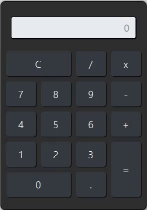

# Simple Calculator
<p align="center">
  
</p> 


## About this project 
This project features JavaScript training. One of the best ways to learn a new programming language, like anything else in your life, you need to practice. This project is a practical way to acquire in JavaScript.
<br>

## Some observations about this project
The calculator is a simple calculator but it has the power to solve small calculations like subtraction, addition, division...
It is important to note that the visual interaction of this content was not developed by me. The visual interface was reused from a class taken in a [Full-Stack Web Development Course](https://www.udemy.com/course/curso-web-design-fundamentos-aprenda-html-css-e-javascript/) on the course platform [Udemy](https://www.udemy.com).
<br>

<p align="center">
  
</p> 

## Why does this project exist?
This project came about as a way to exercise JavaScript in a practical way, being the first project I did in JavaScript. If you're just starting out in this programming language, it's a project that I highly recommend, because in addition to teaching basic but useful JavaScript functions, you'll get a broader view of JavaScript programming. If you haven't been able to do it correctly, try again until you do!
<br>

If you liked the project you have some options...
<br>
 - 🌎 Share this repository with your friends!
 - ⭐ If you liked the idea, you can give it a *fork* and a star.
 - 📬 Email me if you need to: peixinhoyago@gmail.com


## Project Notes
Feel free to make any changes you wish, I also ask you to let me know if you find any errors or have any suggestions or proposals.
<br>

## How to download the project?
```bash

  # Clone the repository
  $ git clone https://github.com/yagopeixinho/simple-calculator


```
```bash
  Another option is to simply open it with Git Hub Desktop.
```
<br>

## Collaborator
<table align="center">
    <tr>
        <td align="center">
            <a href="https://github.com/yagopeixinho">
                
                <br />
                <sub><b>Yago Peixinho</b></sub>
            </a>
        </td>    
    </tr>
</table>
