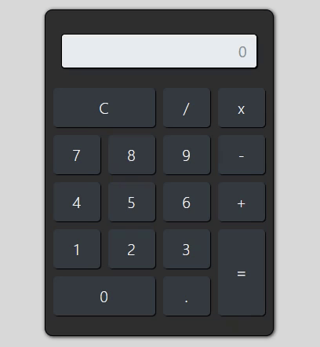

# Simple Calculator

<p align="center">
  
</p>

## Sobre 
Esse projeto tem como funcionalidade o treinamento em JavaScript. Uma das melhores formas de aprender uma nova linguagem de programação, como qualquer outra coisa em sua vida, você precisa praticar. Esse projeto é uma forma prática de adquirir conhecimento em JavaScript.

## Algumas observações
A calculadora é uma calculadora simples mas que tem o poder de resolver cálculos pequenos, como subtração, adição, divisão... 


## Como baixar o projeto/
```bash

  $ git clone https://github.com/yagopeixinho/simple-calculator
  
  $ cd 


```
